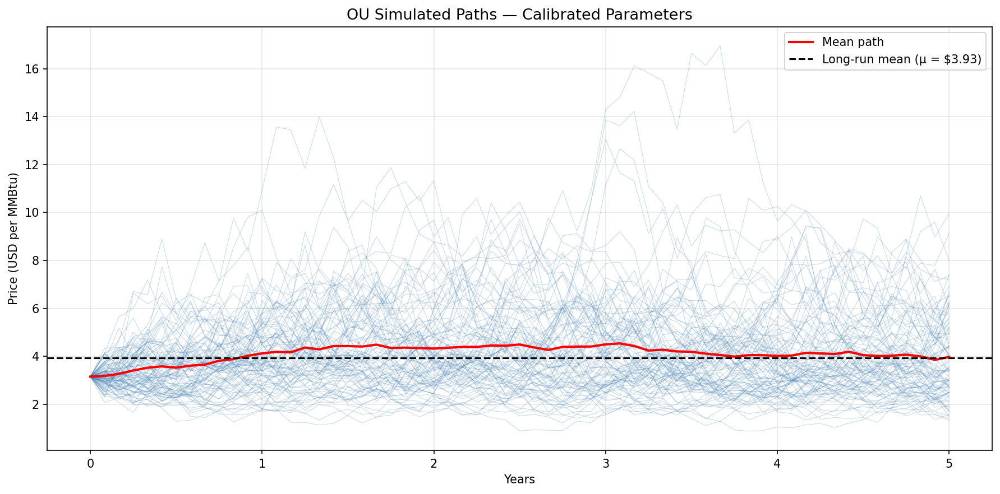
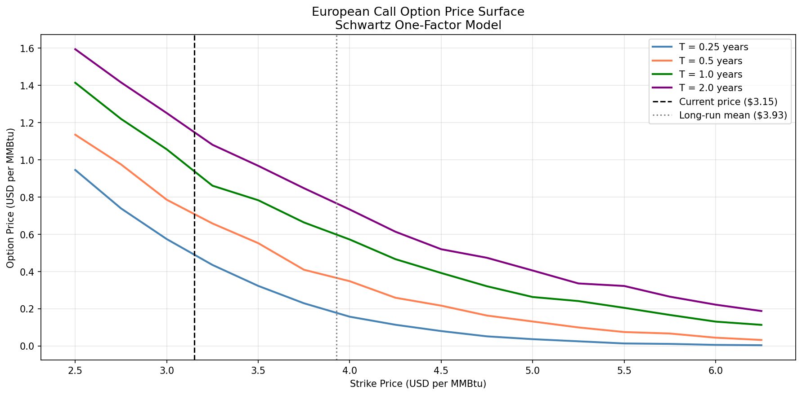
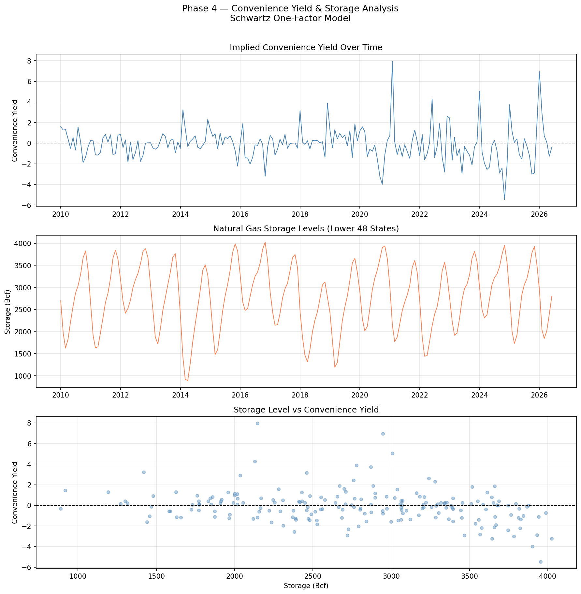
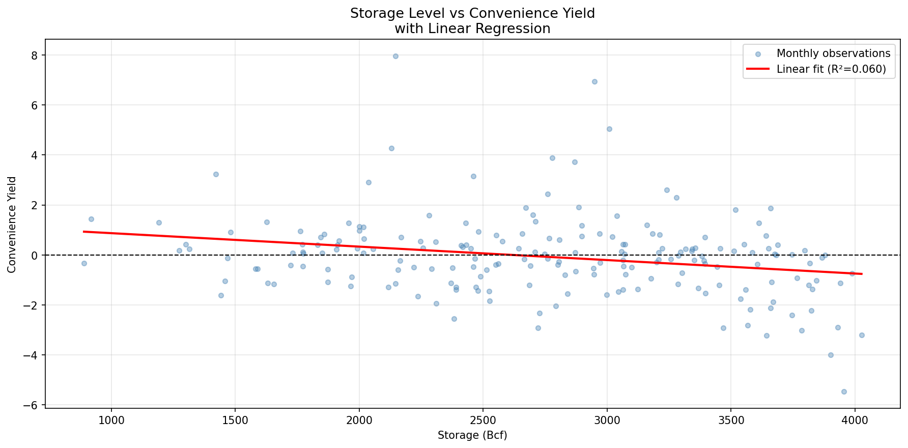

# natural-gas-derivatives-pricing
# Natural Gas Derivatives Pricing: A Schwartz One-Factor Model with Physical Market Grounding

## Overview
This project builds a commodity derivatives pricing model for Henry Hub 
natural gas, calibrated to 25 years of real market data. It implements 
the Schwartz one-factor mean-reverting model, estimates parameters via 
maximum likelihood estimation, prices European call options using Monte 
Carlo simulation, and grounds the financial model in physical market 
dynamics through convenience yield and storage analysis.

Built as an independent quantitative finance project to demonstrate the 
intersection of chemical engineering domain knowledge and stochastic 
modelling.

---

## Motivation
Natural gas prices exhibit strong mean reversion — a property driven by 
physical supply and demand fundamentals rather than investor sentiment. 
Storage constraints, seasonal demand cycles, and pipeline infrastructure 
create a direct link between physical engineering variables and financial 
price dynamics. This project exploits that link, using a chemical 
engineering lens to motivate and interpret a stochastic pricing model.

---

## Methodology

### Phase 1 — Data Collection & Exploratory Data Analysis
- Henry Hub spot price data sourced from FRED API (series MHHNGSP, 
  2000–2026, 316 monthly observations)
- Weekly storage data sourced from EIA API (Lower 48 states, 2010–2026)
- Log returns computed; descriptive statistics reveal annualised 
  volatility of 56%, slight negative skew (-0.34), and excess kurtosis 
  of 4.18 indicating fat tails
- ADF test confirms stationarity (p = 0.005), consistent with 
  mean-reverting price dynamics
- Seasonality analysis reveals W-shaped average monthly price pattern 
  reflecting dual heating and cooling demand peaks

### Phase 2 — Stochastic Model Calibration
The Schwartz one-factor model specifies price dynamics as an 
Ornstein-Uhlenbeck process:

$$dP_t = \kappa(\mu - P_t)dt + \sigma dW_t$$

- Model discretised via Euler-Maruyama scheme for simulation
- Parameters calibrated in log price space via maximum likelihood 
  estimation to ensure constant volatility across the sample
- Calibrated parameters: κ = 0.8392, μ = $3.93, σ = 0.5719
- Model validation confirms accurate mean reproduction but expected 
  underestimation of kurtosis, consistent with Gaussian shock assumptions

### Phase 3 — Derivative Pricing
- European call options priced via Monte Carlo simulation across strikes 
  $2.50–$6.50 and expiries 0.25–2.0 years
- Option price surface demonstrates mean reversion suppressing option 
  prices beyond μ at longer maturities — a key distinction from 
  Black-Scholes equity option pricing
- 10,000 simulation paths used for numerical stability

### Phase 4 — Physical Market Grounding
- Front-month NYMEX futures data sourced via yfinance
- Implied convenience yield estimated from cost-of-carry relationship:
  cy = r + c - (1/T) × ln(F/S)
- Empirical analysis confirms inverse relationship between storage levels 
  and convenience yield (R² = 0.06), consistent with theory while 
  reflecting the multi-factor nature of scarcity premia
- January 2026 winter squeeze captured: spot $7.72 vs futures $4.35, 
  implied convenience yield 6.94 — demonstrating backwardation in 
  practice

---

## Key Results

### Calibrated Parameters
| Parameter | Value | Interpretation |
|-----------|-------|----------------|
| κ | 0.8392 | Moderate mean reversion speed |
| μ | $3.93 | Long-run equilibrium price |
| σ | 0.5719 | Annualised volatility in log space |
### Simulated Price Paths

### Option Prices at 1-Year Expiry
| Strike | Option Price | In the Money |
|--------|-------------|--------------|
| $3.00 | $1.0348 | 67.5% |
| $3.50 | $0.7391 | 52.0% |
| $4.00 | $0.5201 | 38.7% |
| $4.50 | $0.3714 | 27.4% |
| $5.00 | $0.2540 | 19.9% |

### Option Price Surface

### Convenience Yield & Storage Analysis

### Storage vs Convenience Yield

---

## Limitations
- **Fat tails:** The Gaussian OU model cannot reproduce excess kurtosis 
  of 4.18 observed historically; a jump-diffusion extension would 
  address this
- **Single factor:** The one-factor model assumes a constant long-run 
  mean μ, missing the structural shift in prices following the US shale 
  revolution (~2008–2012)
- **Seasonality:** The W-shaped seasonal price pattern is not captured 
  by the one-factor specification; a two-factor model with a seasonal 
  component would be more appropriate
- **Convenience yield:** Front-month futures approximation used in 
  absence of full forward curve data; a Bloomberg terminal would enable 
  richer curve analysis
- **Measure change:** Parameters are calibrated under the real-world (historical) measure via MLE on spot price history. Derivative pricing formally requires simulation under the risk-neutral measure, where the long-run mean is adjusted by the market price of risk λ. This simplification is standard in academic commodity models but would require futures curve calibration to resolve fully. 

---

## Technical Stack
- **Language:** Python 3
- **Libraries:** pandas, numpy, matplotlib, scipy, statsmodels, 
  fredapi, yfinance
- **Data sources:** FRED API (Henry Hub spot), EIA API (storage), 
  NYMEX via yfinance (futures)
- **Environment:** JupyterLab

---

## Author
Kishor | Chemical Engineering, University of Nottingham (Year 2)
